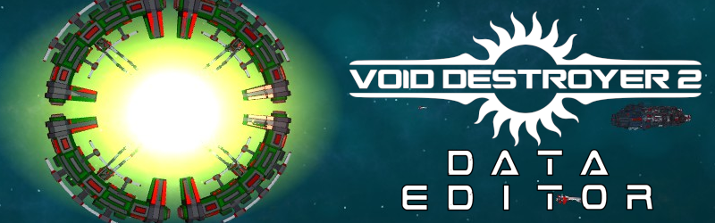

# Void Destroyer 2 Data Editor
A 3rd party data editor tool for modding the game Void Destroyer 2

Uses dotnet 4.0, winforms, and Ogre 1.12.1

How it works:

Data used by Void Destroyer 2 to define objects comes in the form of XML files, 
this program reads in all the possible properties of each type of object into
an object that can be viewed in a property grid control. It displays all the 
definitions that can be viewed within a tabbed tree.

You can make changes to the properties of the object definitions and save them back 
to XML. Ships also have a 3d WYSIWYG view that reacts to changes to rotating elements
turrets and attachments.
